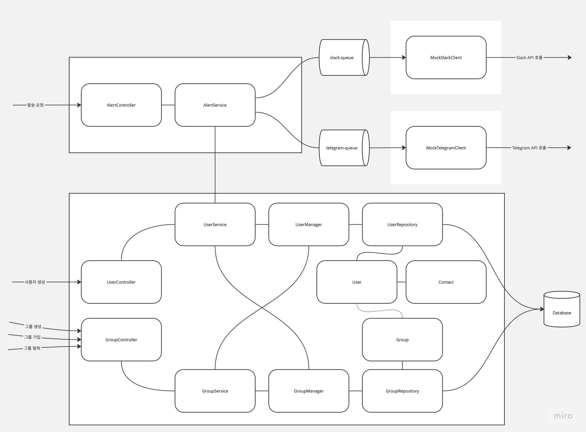

# 간단한 공지 알림 서비스의 PoC 구현

사용자들은 본인이 연락 받고자 하는 메신저 정보를 등록하고 특정 메시지 그룹에 가입할 수 있습니다.

서비스를 통해서 사용자 또는 그룹에 메시지를 발송하면 사용자들은 등록한 메신저로 메시지를 전달 받을 수 있습니다.

단, 본 서비스는 실제 사용을 목적으로 개발되지 않았으므로 등록하는 메신저 서비스는 실제 메신저를 사용하도록 구현되지 않았습니다. 

## 아키텍처



## 테이블 정보

user: 사용자 정보와 메신저 연락처 정보를 저장합니다. 연락처 정보는 1개만 저장 가능합니다.

group: 그룹 정보를 저장합니다.

group_user: 그룹에 속한 사용자 정보를 저장합니다. user-group 간 일대다 매핑 정보 입니다.

```sql
create table "user"
(
    id bigint primary key auto_increment,           -- id, pk
    name varchar(255),                              -- name, 이름
    type varchar(10),                               -- type, 메신저 타입 (slack or telegram)
    token varchar(128),                             -- token, 메신저 토큰 정보
    channel varchar(255),                           -- channel, 메신저 채널 정보
    created_at timestamp default current_timestamp
);
create table "group"
(
    id bigint primary key auto_increment,           -- id, pk
    name varchar(255),                              -- name, 이름
    created_at timestamp default current_timestamp
);
create table "group_user"
(
    id bigint primary key auto_increment,           -- id, pk
    group_id bigint not null,                       -- group_id, 그룹 id
    user_id bigint not null,                        -- user_id, 사용자 id
    created_at timestamp default current_timestamp
);
```

## 사용 라이브러리
* spring-data-jdbc
* spring-web
* spring-amqp
* flyway
* lombok

## 사용 가능한 API
IntelliJ 에서는 app.http 파일을 통해 직접 실행해 볼 수 있습니다.

### 유저 생성
```
POST localhost:8080/v1/user/create
Content-Type: application/json

{
  "name": "test_user2",
  "contact": {
    "type": "telegram",
    "token": "token",
    "channel": "channel"
  }
}
```


### 그룹 생성
```
POST localhost:8080/v1/group/create
Content-Type: application/json

{
  "name": "test_group"
}
```

### 그룹 가입
```
POST localhost:8080/v1/group/join
Content-Type: application/json

{
  "nickname": "test_user",
  "group_name": "test_group"
}
```

### 그룹 탈퇴
```
POST localhost:8080/v1/group/leave
Content-Type: application/json

{
  "nickname": "test_user",
  "group_name": "test_group"
}
```

### 알람 발송
```
POST http://localhost:8080/v1/alerts
Content-Type: application/json

{
  "target": [ "@test_user", "@@team1", "@all" ],
  "severity": "normal",
  "message" : "node1 down"
}
```

## 실행 방법
```
./gradlew build
docker-compose -f docker-compose.yml up -d
```